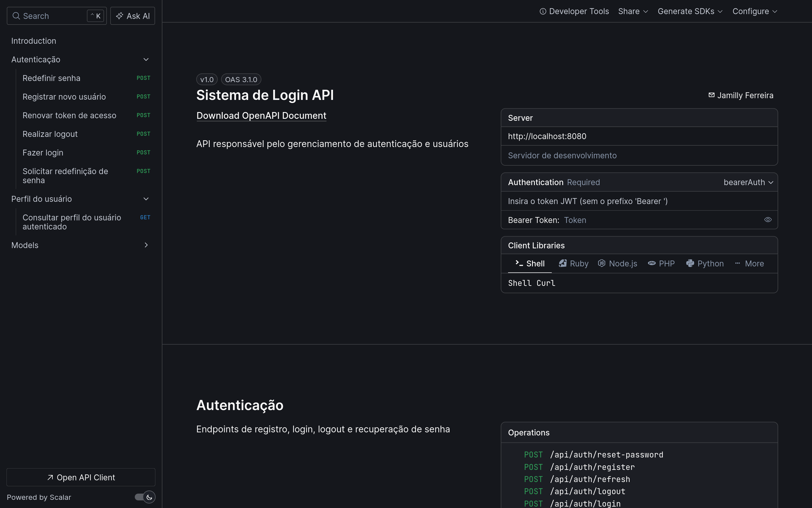
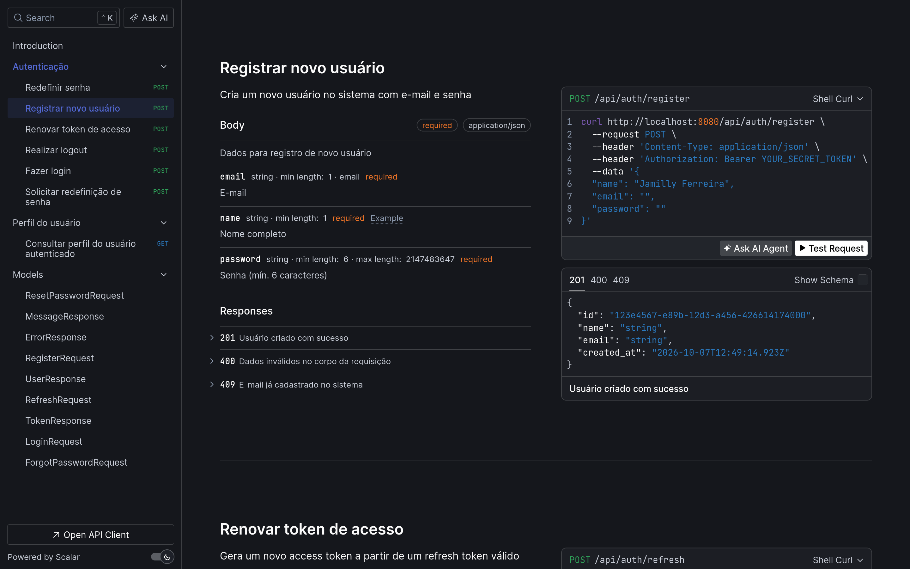
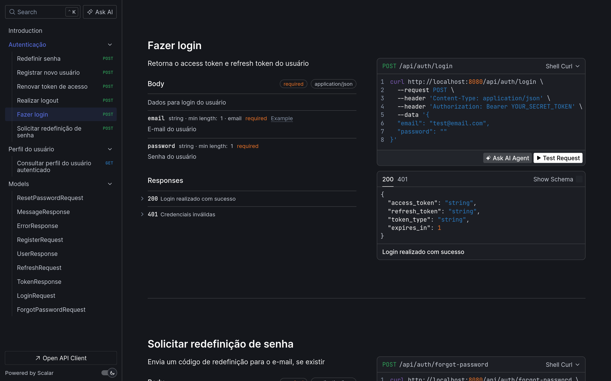
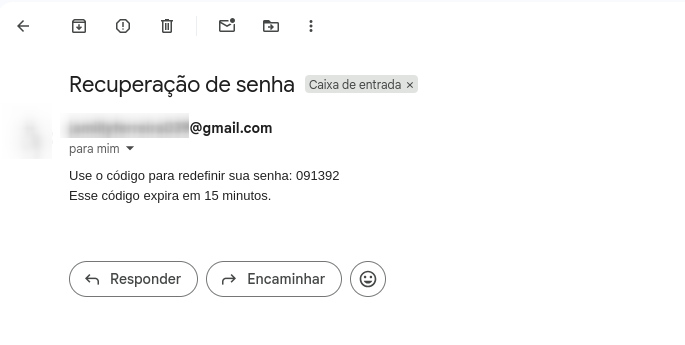

# Sistema de Login

API REST de autenticação construída com **Java 21** e **Spring Boot**, com JWT de curta duração, refresh token com rotação e recuperação de senha por e-mail.

## Funcionalidades

- Cadastro e login com senha criptografada (BCrypt)
- Access token JWT de curta duração (10 minutos)
- Refresh token opaco, guardado como hash, com **rotação** a cada uso e revogação
- Logout que revoga o refresh token (idempotente)
- Recuperação de senha por e-mail, com código de 6 dígitos de uso único
- Revogação de todas as sessões ativas ao redefinir a senha
- Rate limit nos endpoints sensíveis (login, forgot-password e reset-password)
- Tratamento global de erros, com resposta padronizada
- Aplicação containerizada com Docker (build multi-stage e usuário sem privilégios) e Docker Compose
- Documentação interativa da API com OpenAPI e Scalar

## Tecnologias

| Área           | Tecnologia                                        |
|----------------|---------------------------------------------------|
| Linguagem      | Java 21                                           |
| Framework      | Spring Boot (Web MVC, Data JPA, Validation, Mail) |
| Segurança      | Spring Security, JWT (JJWT), BCrypt               |
| Documentação   | OpenAPI (springdoc) e Scalar                      |
| Rate limit     | Bucket4j e Caffeine                               |
| Banco de dados | PostgreSQL 18                                     |
| Migrations     | Flyway                                            |
| Infraestrutura | Docker e Docker Compose, Maven                    |

## Como executar

### Pré-requisitos

- Docker e Docker Compose
- Java 21 (só para rodar a aplicação fora do Docker)
- Uma conta Gmail com **senha de app** (exige verificação em duas etapas), usada para enviar os e-mails de recuperação de senha

#### Configuração inicial

1. Clone o repositório e entre na pasta do projeto.
2. Crie o arquivo .env na raiz, a partir do exemplo, e preencha os valores (veja a tabela de variáveis abaixo):

```bash
cp .env.example .env
```

#### Opção 1: tudo no Docker (API e banco)

Com o .env preenchido, basta subir a aplicação e o banco juntos:

```bash
docker compose up -d --build
docker compose logs -f api
```
O Dockerfile usa build multi-stage, então a imagem final contém apenas o JRE e o .jar da aplicação.

No container, a aplicação não ativa nenhum profile do Spring: 
o application.yaml já aponta para o banco pelo nome do serviço (postgres).

A API sobe em http://localhost:8080 com as migrations do Flyway aplicadas automaticamente.


#### Opção 2: API na máquina, só o banco no Docker
1. Suba apenas o banco (se subir tudo, o container da API ocupa a porta 8080):

```bash
docker compose up -d 
```
2. Rode a aplicação com o profile dev, que aponta para localhost

### Variáveis de ambiente

| Variável            | Descrição                             |
|---------------------|---------------------------------------|
| `POSTGRES_DB`       | Nome do banco de dados                |
| `POSTGRES_USER`     | Usuário do banco                      |
| `POSTGRES_PASSWORD` | Senha do banco                        |
| `JWT_SECRET`        | Chave de assinatura do JWT, em Base64 |
| `MAIL_USERNAME`     | Conta Gmail que envia os e-mails      |
| `MAIL_PASSWORD`     | Senha de app do Gmail                 |

Para gerar um `JWT_SECRET`:

```bash
openssl rand -base64 64
```

O arquivo `.env` está no `.gitignore` e nunca deve ser versionado.

## Documentação da API
Pelo Scalar é possível testar todos os endpoints direto no navegador. Para as rotas autenticadas, informe o access token no campo de autenticação Bearer.




A documentação interativa fica em `http://localhost:8080/scalar` com a aplicação rodando.

A especificação OpenAPI completa está versionada em [`docs/openapi.json`](docs/openapi.json). Dá para importá-la no Postman, no Insomnia ou em qualquer visualizador OpenAPI sem precisar subir a aplicação.

<details>
<summary>Mais capturas</summary>

**Cadastro de usuário**



**Login**



</details>

## Endpoints

| Método | Rota                        | Acesso      | Descrição                                                             |
|--------|-----------------------------|-------------|-----------------------------------------------------------------------|
| `POST` | `/api/auth/register`        | público     | Cria um usuário                                                       |
| `POST` | `/api/auth/login`           | público     | Autentica e devolve access token e refresh token                      |
| `POST` | `/api/auth/refresh`         | público     | Troca o refresh token por um novo par de tokens (o antigo é revogado) |
| `POST` | `/api/auth/logout`          | público     | Revoga o refresh token enviado                                        |
| `POST` | `/api/auth/forgot-password` | público     | Envia o código de redefinição por e-mail                              |
| `POST` | `/api/auth/reset-password`  | público     | Redefine a senha usando o código recebido                             |
| `GET`  | `/api/users/me`             | autenticado | Retorna os dados do usuário autenticado                               |

As rotas autenticadas exigem o cabeçalho `Authorization: Bearer <access_token>`.
Sem token, com token inválido, expirado ou de um usuário que não existe mais, a resposta é 401.

### Exemplo: login

```json
{
  "email": "usuario@exemplo.com",
  "password": "minhaSenha123"
}
```

Resposta:

```json
{
  "access_token": "eyJhbGciOi...",
  "refresh_token": "3f1c9a52-...",
  "token_type": "Bearer",
  "expires_in": 600
}
```
### Exemplo: usuário autenticado

#### GET `/api/users/me`

```json
{
  "id": "1850e2be-578f-4492-bb55-82d826c1db00",
  "name": "Test User",
  "email": "test@example.com",
  "created_at": "2026-10-06T14:14:34.012826Z"
}
```

### Exemplo: erro

Todos os erros seguem o mesmo formato:

```json
{
  "type": "about:blank",
  "title": "Unauthorized",
  "status": 401,
  "detail": "Refresh token inválido ou expirado",
  "path": "/auth/refresh",
  "timestamp": "2026-10-03T16:09:26.706282885Z"
}
```

Erros de validação trazem também a lista de campos inválidos.

## Rate limit
O rate limit é feito por um HandlerInterceptor com Bucket4j (algoritmo token bucket), e os buckets ficam em um cache Caffeine.
Cada combinação de IP + rota tem o seu próprio bucket, que recarrega de forma gradual (refillGreedy).

| Rota                             | Limite                          |
|----------------------------------|---------------------------------|
| `POST /api/auth/login`           | 10 requisições a cada 5 minutos |
| `POST /api/auth/forgot-password` | 3 requisições a cada 15 minutos |
| `POST /api/auth/reset-password`  | 5 requisições a cada 15 minutos |
| Demais rotas                     | 30 requisições por minuto       |

Os buckets expiram após 1 hora sem acesso, e o cache guarda no máximo 10.000 entradas, o que evita crescimento ilimitado de memória.

Ao exceder o limite, a API responde 429 Too Many Requests que informa em segundos quanto tempo o cliente deve esperar, 
e o corpo segue o mesmo formato padronizado de erro:


```json
{
   "type": "about:blank",
   "title": "Too Many Requests",
   "status": 429,
   "detail": "Muitas requisições. Tente novamente em (seconds) segundos",
   "path": "/api/auth/forgot-password",
   "timestamp": "2026-10-06T14:40:12.114Z"
}
```

## Fluxo de recuperação de senha

1. O cliente envia o e-mail para `POST /api/auth/forgot-password`:

   ```json
   { "email": "usuario@exemplo.com" }
   ```

2. A API responde sempre da mesma forma, exista o e-mail ou não. Se ele existir, um código de 6 dígitos é gerado e enviado por e-mail em segundo plano.

   ```json
   {
    "message": "Se o e-mail existir, um código de redefinição será enviado."
   }
   ```
   E-mail de recuperação recebido em um teste real (ambiente de desenvolvimento):


3. O cliente envia o código e a nova senha para `POST /api/auth/reset-password`:

   ```json
   {
     "code": "091392",
     "new_password": "novaSenha123"
   }
   ```

4. Se o código for válido, a senha é trocada, o código é marcado como usado e todos os refresh tokens do usuário são revogados. Código inexistente, expirado ou já usado recebe a mesma resposta (`400`), sem revelar qual foi o caso.


5. Resposta de senha alterada:
   ```json
   {
     "message": "Senha alterada com sucesso"
   }
   ```
   
## Decisões de segurança

**Autenticação**
- Sessões stateless e CSRF desabilitado, já que a autenticação é feita por token no cabeçalho.
- Senhas guardadas com BCrypt.
- Access token com 10 minutos de validade, o que limita a janela de uso de um token vazado.
- Falhas de autenticação no filtro JWT (token malformado, assinatura inválida, expirado ou usuário inexistente) são 
tratadas no próprio filtro e resultam em 401, em vez de estourar como erro interno

**Refresh token**
- Valor aleatório e opaco. No banco fica só o hash (SHA-256), e o valor original é entregue uma única vez ao cliente.
- Rotação: cada uso revoga o token anterior, então um token reutilizado é recusado.
- Logout idempotente: repetir o logout, ou usar um token já inválido, responde `204` sem erro.

**Recuperação de senha**  
- Resposta idêntica para e-mail existente e inexistente, para não revelar quais e-mails estão cadastrados (user enumeration).
- E-mail enviado de forma assíncrona (@Async), para o tempo de resposta também não revelar se o e-mail existe.
- Código gerado com SecureRandom, válido por 15 minutos e de uso único.
- Um código ativo por usuário: ao pedir um novo, o anterior é apagado.
- A mensagem de erro do reset é a mesma para código inexistente, expirado ou já usado.
- O INSERT do código é enviado ao banco antes do envio do e-mail.
- Os logs do fluxo de reset não registram o código nem o e-mail informado.
- Rate limit mais restrito nos endpoints do fluxo (3 pedidos de código e 5 tentativas de reset a cada 15 minutos por IP), 
dificultando abuso de envio de e-mails e tentativas de adivinhar o códig

## Banco de dados

O schema é versionado com Flywy (`src/main/resources/db/migration`), e o Hibernate roda com `ddl-auto: validate`, apenas conferindo se as entidades batem com as tabelas.

| Tabla                   | Conteúdo                                                                      |
|-------------------------|-------------------------------------------------------------------------------|
| `users`                 | Usuários (chaves primárias UUID)                                              |
| `refresh_tokens`        | Hash do refresh token, expiração, flag de revogação e usuário                 |
| `password_reset_tokens` | Código de redefinição, expiração, flag de uso e usuário (`ON DELETE CASCADE`) |


## Próximos passos

- Guardar o código de redefinição como hash
- Rate limit nos endpoints de recuperação de senha
- Job agendado para limpar códigos expirados
- Entregar o refresh token em cookie HttpOnly
- Login com Google (OAuth2)
- Testes automatizados

## Autora

Jamilly Ferreira | [LinkedIn](https://www.linkedin.com/in/jamillyferreira/)